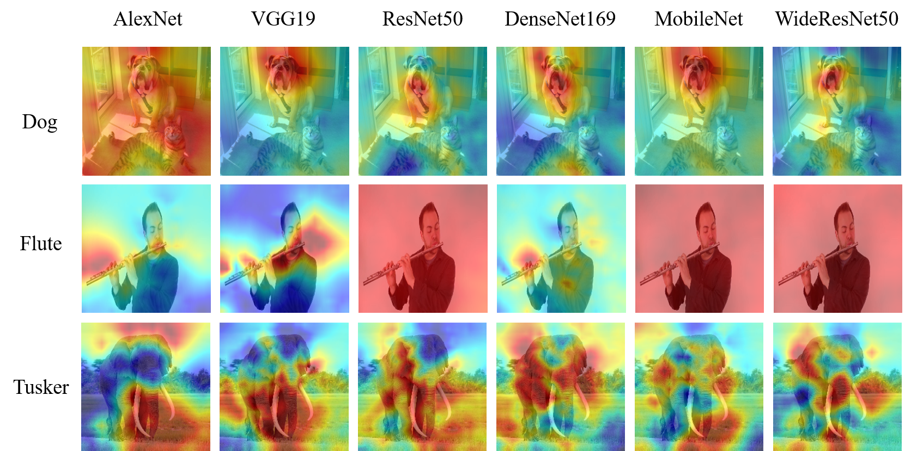

# Interpretable Explanations of Black Boxes by Meaningful Perturbation




## Requirements

- Pytorch 1.14 
- Python 3.6
- cv2 4.4.0
- matplotlib 3.3.1
- CUDA 10.1 (optional)


## Running the code

This code is baesed on ImageNet dataset

```shell
python main.py --model_path=VGG19 --img_path=examples/catdog.png
```

Arguments:

- `model_path` - Choose a pretrained model (AlexNet, VGG19, ResNet50, DenseNet169, MobileNet...) or saved model (.pt) 
- `img_path` - Image Path
- `perturb` - Choose a perturbation method (blur, noise)
- `tv_coeff` - Coefficient of TV
- `tv_beta` - TV beta value
- `l1_coeff` - L1 regularization
- `factor` - Factor to upsampling
- `lr` - Learning rate
- `iter` - Iteration

### How to use your customized model

If you want to use customized model that has a type 'OrderedDict', you shoud type a code that loads model object.

Search 'load model' function in utils.py and type a code such as:
'''
from yourNetwork import yourNetwork())
model=yourNetwork()
''''

## Understanding this Method (Algorithm)!

Check my blog!!
[Meaningful_Perturbation in da2so](https://da2so.github.io/2020-08-11-Meaningful_Perturbation/)